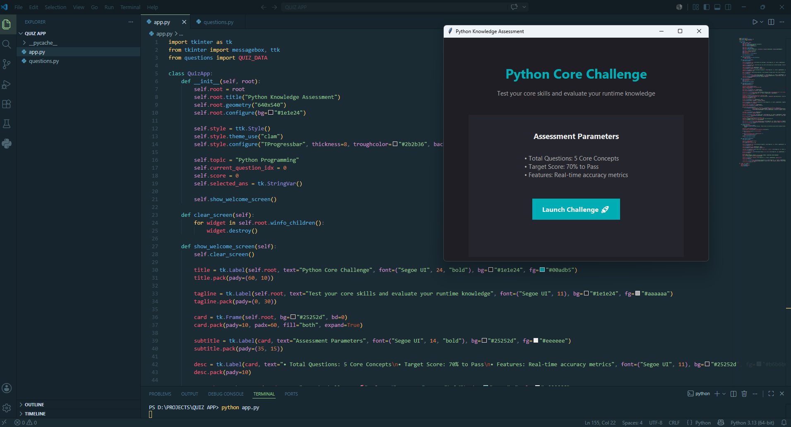
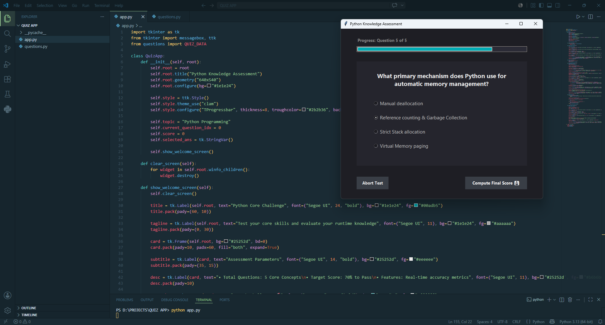
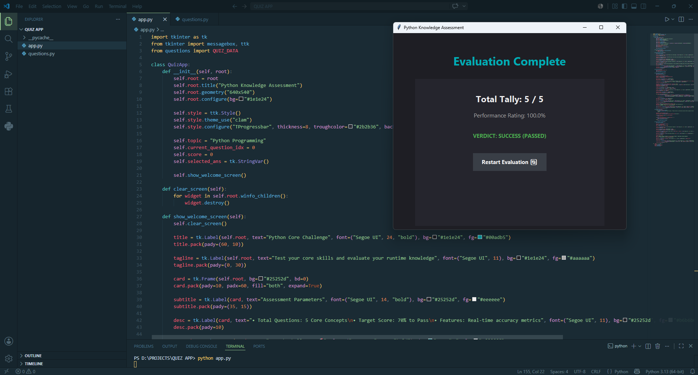

# 🧠 Quiz App

<div align="center">


### An Interactive Quiz Application Built with Python and Tkinter

Test your knowledge through an engaging multiple-choice quiz experience with real-time progress tracking and instant performance evaluation.

</div>

---

## 📖 Overview

Quiz App is a modern desktop-based quiz application developed using **Python** and **Tkinter**. The application provides users with an interactive platform to assess their knowledge through multiple-choice questions in a visually appealing environment.

The project features a clean dark-themed interface, dynamic progress tracking, automatic score calculation, and pass/fail evaluation. It demonstrates GUI development, event handling, and object-oriented programming concepts in Python.

Whether you're a beginner learning Python or someone looking to practice programming concepts, this application offers a fun and effective way to test your knowledge.

---

## ✨ Features

### 🎨 Modern User Interface

- Clean and professional dark-themed design
- User-friendly navigation
- Responsive layout
- Interactive buttons and controls

### 📚 Quiz Functionality

- Multiple Choice Questions (MCQs)
- Single-answer selection
- Interactive question navigation
- Input validation before moving forward

### 📊 Progress Tracking

- Dynamic progress bar
- Real-time quiz progress updates
- Current question indicator

### 🏆 Performance Evaluation

- Automatic score calculation
- Percentage-based performance analysis
- Pass/Fail determination
- Instant results display

### 🔄 User Experience

- Welcome screen with assessment details
- Quiz restart functionality
- Smooth screen transitions
- Warning messages for unanswered questions

---

## 📂 Project Structure

```text
Quiz-App/
│
├── app.py
├── questions.py
├── README.md
│
└── Screenshots/
    ├── Screenshot-1.png
    ├── Screenshot-2.png
    └── Screenshot-3.png
```

---

## 🖼️ Screenshots

### 🏠 Home Screen

The welcome screen introduces users to the assessment and displays quiz information.



---

### ❓ Quiz Interface

Users answer multiple-choice questions while tracking their progress.



---

### 📊 Results Screen

After completing the quiz, users receive their final score and performance summary.



---

## 🚀 Getting Started

### Prerequisites

Before running the application, ensure you have:

- Python 3.x installed
- Tkinter (included with most Python installations)

Verify installation:

```bash
python --version
```

---

## ⚙️ Installation

### Clone the Repository

```bash
git clone https://github.com/SajidAli7076/Quiz-App.git
```

### Navigate to the Project Directory

```bash
cd Quiz-App
```

### Run the Application

```bash
python app.py
```

The application window will launch automatically.

---

## 🎯 How It Works

1. Launch the application.
2. Review the quiz information.
3. Click **Launch Challenge 🚀**.
4. Read each question carefully.
5. Select the correct answer.
6. Navigate through all questions.
7. Submit the quiz.
8. View your final score and performance report.

---

## 📝 Quiz Content

The current version contains questions related to Python programming concepts, including:

- Python Data Types
- Functions
- Operators
- List Methods
- Memory Management
- Garbage Collection

### Sample Questions

- Which of the following is an immutable data type in Python?
- What keyword is used to define a function in Python?
- What is the output of `print(2 ** 3)`?
- Which method adds an element to the end of a list?
- What primary mechanism does Python use for automatic memory management?

---

## 📊 Assessment System

The application automatically evaluates user performance.

### Score Calculation

```python
if self.selected_ans.get() == correct_answer:
    self.score += 1
```

### Percentage Calculation

```python
percentage = (score / total_questions) * 100
```

### Pass Criteria

A score of **70% or above** is required to pass the assessment.

| Correct Answers | Percentage | Result |
|----------------|------------|---------|
| 5/5 | 100% | ✅ Pass |
| 4/5 | 80% | ✅ Pass |
| 3/5 | 60% | ❌ Fail |
| 2/5 | 40% | ❌ Fail |
| 1/5 | 20% | ❌ Fail |
| 0/5 | 0% | ❌ Fail |

---

## 🛠️ Technologies Used

| Technology | Purpose |
|------------|---------|
| Python | Programming Language |
| Tkinter | GUI Development |
| ttk | Styled Widgets |
| OOP | Application Architecture |

---

## 💡 Concepts Demonstrated

This project showcases:

- Object-Oriented Programming (OOP)
- GUI Development with Tkinter
- Event Handling
- State Management
- User Interface Design
- User Experience Design
- Python Fundamentals

---

## 🔮 Future Enhancements

Potential improvements include:

- Multiple Quiz Categories
- Difficulty Levels
- Countdown Timer
- Question Randomization
- User Login System
- Database Integration
- Leaderboard System
- Result History Tracking
- Export Results Feature
- Sound Effects and Animations

---

## 🌐 Repository Link

**GitHub Repository:**  
https://github.com/SajidAli7076/Quiz-App

---

## 🔗 LinkedIn Project Showcase

Check out the LinkedIn post featuring this project:

**🔗 LinkedIn Post:**  
https://www.linkedin.com/posts/sajid-ali2005_quizapp-python-tkinter-ugcPost-7470084841032839168-g765/

Feel free to connect with me and share your feedback!

---

## 🤝 Contributing

Contributions are welcome.

1. Fork the repository

2. Create a new branch

```bash
git checkout -b feature-name
```

3. Commit your changes

```bash
git commit -m "Add new feature"
```

4. Push to GitHub

```bash
git push origin feature-name
```

5. Open a Pull Request

---

## 📜 License

This project is licensed under the MIT License.

Feel free to use, modify, and distribute this project for educational and personal purposes.

---

## 👨‍💻 Author

### Sajid Ali

🔗 LinkedIn: https://www.linkedin.com/in/sajid-ali2005

💻 GitHub: https://github.com/SajidAli7076

---

## ⭐ Support

If you found this project useful:

- ⭐ Star the repository
- 🍴 Fork the project
- 📢 Share it with others

---

<div align="center">

### Thank You for Visiting!

Made with ❤️ using Python and Tkinter

</div>
